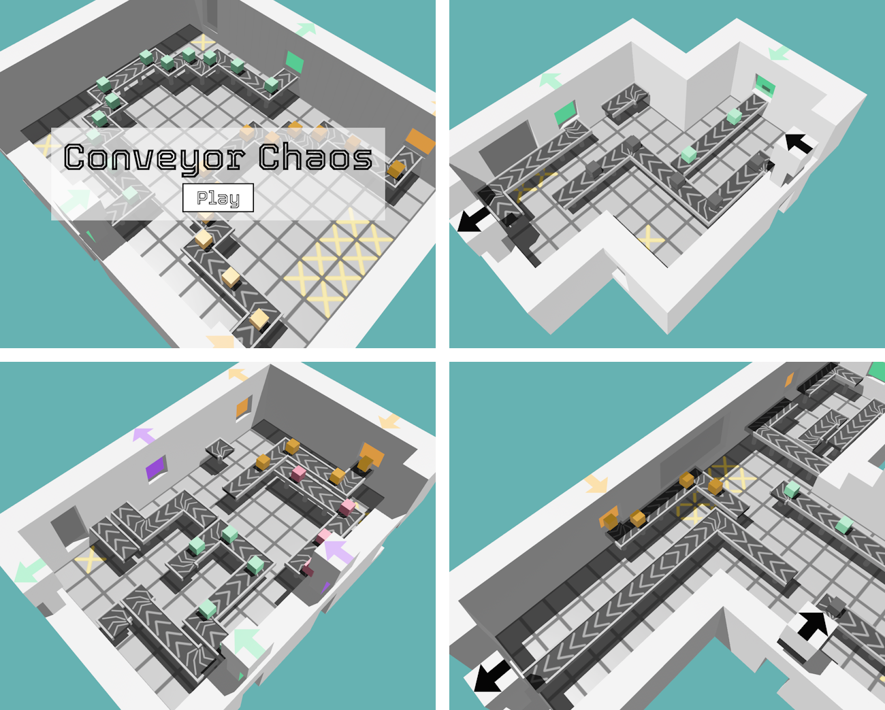

# Conveyor Chaos - Ludum Dare 54

A block puzzle game about laying out conveyor belts.

My entry to the 54:rd Ludum Dare game jam (theme: *Limited space*), following the compo rules (alone, from scratch, 48 hours).

[Play the game in Your browser](https://aggrathon.github.io/LudumDare54/) or [check out the Ludum Dare entry](https://ldjam.com/events/ludum-dare/54/conveyor-chaos)!

## Software Used

Bevy (game engine), Visual Studio Code (code), Rust (language), Audacity (sound), Blender (graphics), Tourney (font), git (version control), and Github (hosting).

